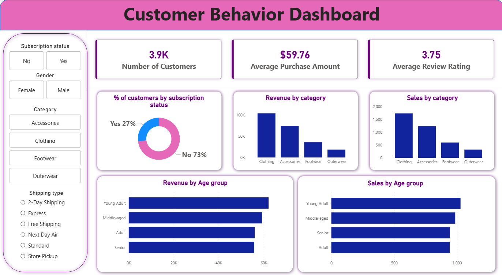

# 🛍️ Customer Behavior Analytics Dashboard  

An end-to-end Customer Behavior Analytics project built using Python, SQL, and Power BI to analyze customer purchasing patterns and generate actionable business insights.

---

## 📊 Dashboard Preview

> Upload your dashboard screenshot in the main project folder and rename it to `dashboard.png`

---

## 📌 Project Overview

This project analyzes customer shopping behavior data to understand:

- Revenue trends  
- Customer segmentation  
- Age-group based purchasing  
- Subscription impact  
- Product category performance  

The goal is to transform raw transactional data into meaningful KPIs and interactive visual insights for business decision-making.

---

## 🛠 Tech Stack

**Programming & Analysis**
- Python  
- Pandas  
- NumPy  
- Matplotlib  
- Seaborn  
- Plotly  

**Database**
- MySQL  
- SQL (Joins, Group By, Aggregations)

**Visualization**
- Power BI  

---

## 📈 Key KPIs Generated

- Total Customers  
- Average Purchase Amount  
- Average Rating  
- Revenue by Category  
- Sales by Age Group  
- Subscription Percentage  

---

## ⚙️ Project Workflow

1. Data Collection from CSV file  
2. Data Cleaning & Preprocessing using Python  
3. Exploratory Data Analysis (EDA)  
4. SQL Queries for KPI extraction  
5. Data connection between MySQL and Power BI  
6. Interactive Dashboard Development  

---

## 🚀 How to Run

Install required libraries:
pip install pandas numpy matplotlib seaborn plotly mysql-connector-python

Run Jupyter Notebook:

jupyter notebook

Import SQL file into MySQL:

SOURCE your_sql_file_name.sql;

---

## 💼 Resume Project Description

Developed an end-to-end Customer Behavior Analytics Dashboard using Python, MySQL, and Power BI. Performed data cleaning, EDA, and SQL-based KPI extraction to analyze customer purchasing trends and built interactive dashboards for business insights.

---

## 🎯 Project Objective

To convert raw customer data into actionable insights that help businesses improve targeting strategy, customer engagement, and revenue growth.

---

## 📬 Contact

your-email@example.com  
https://linkedin.com/in/your-profile  

---

⭐ If you found this project useful, consider giving it a star!
